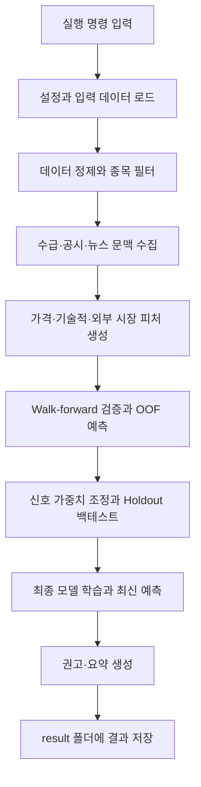
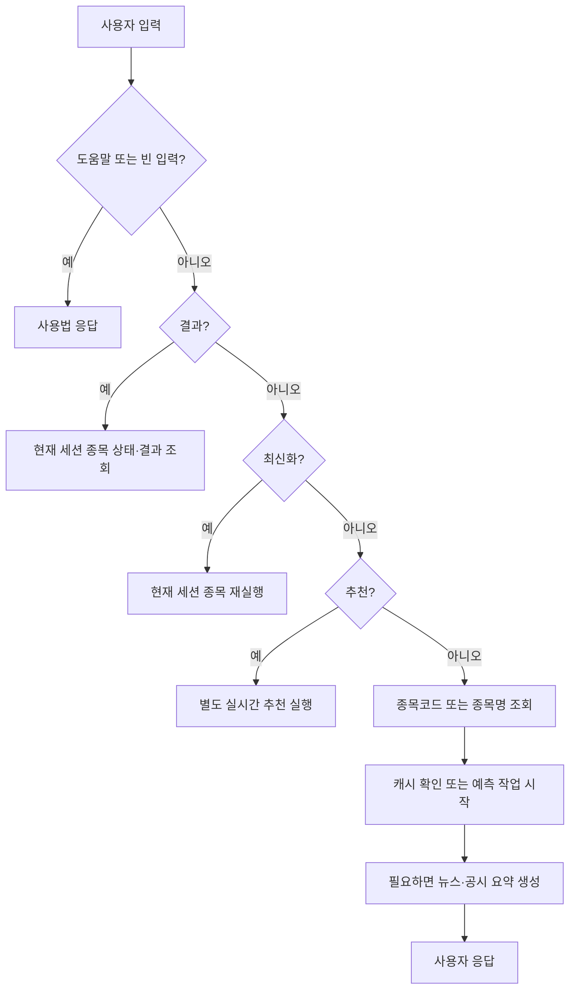

# Stock Predict 프로그램 운영 가이드

> 기준: 2026-06-05 현재 코드
> 목적: 프로그램을 실행하는 순간부터 결과 확인과 챗봇 사용까지, 실제 동작 순서대로 설명한다.

## 1. 문서 목적과 핵심 원칙

이 프로젝트는 여러 종목의 과거 가격·거래량·시장·수급 데이터를 사용해 다음 거래일과 여러 기간의 수익률을 예측한다. 시간 순서를 지키는 검증과 백테스트를 수행한 뒤 결과를 `result/`에 저장한다.

반드시 지켜야 할 원칙:

- 메인 파이프라인의 **매수·매도·관망 권고는 `predicted_return`만으로 결정**한다.
- 뉴스, 공시, 요약, 뉴스 영향 점수는 **표시용 참고 정보**다.
- 뉴스와 공시는 `predicted_return`, 종목 순위, 메인 권고를 변경하면 안 된다.
- 챗봇에서 `추천`을 입력해 실행하는 실시간 추천은 메인 파이프라인 권고와 **별도 흐름**이다.
- 모든 결과는 연구·운영 참고용이며 투자 자문이나 자동매매 결과가 아니다.

---

## 2. 전체 실행 흐름

운영자가 파이프라인을 실행하면 프로그램은 다음 순서로 동작한다.



실행 후에는 두 가지 방법으로 결과를 사용한다.

1. `result/` 아래의 CSV·JSON을 직접 확인한다.
2. Kakao/Colab 챗봇에서 종목 조회, `결과`, `최신화`, `추천` 기능을 사용한다.

---

## 3. 실행 전 준비

### 3.1 Python 환경 준비

Python 3.10 이상이 필요하다. 설치, 실행, 테스트에 같은 Python 환경을 사용한다.

```powershell
python -m pip install -r requirements.txt
python -m pip install -e .
```

### 3.2 입력 OHLCV CSV 확인

필수 열:

| 열 | 의미 |
|---|---|
| `Date` | 거래일 |
| `Open` | 시가 |
| `High` | 고가 |
| `Low` | 저가 |
| `Close` | 종가 |
| `Volume` | 거래량 |

여러 종목을 처리하려면 `Symbol` 열도 필요하다. CSV는 샘플 데이터 또는 실데이터를 사용할 수 있다.

### 3.3 기본 종목 유니버스

- 기본 실데이터 수집 대상은 `data/kospi200_symbol_name_map.csv`의 KOSPI200 200종목이다.
- `--real-symbols`를 지정하면 입력한 종목만 우선 사용한다.
- `--universe-csv`를 지정하면 해당 CSV의 `Symbol` 열을 우선 사용한다.
- 일반 실행에서 `--universe-csv`를 생략하면 입력 OHLCV CSV에 있는 종목 전체를 처리한다.
- KOSDAQ 지수는 외부 시장 피처로 쓸 수 있지만 KOSDAQ 종목은 기본 유니버스에 포함되지 않는다.

### 3.4 선택적 외부 연동

필요할 때만 다음 환경 변수 또는 CLI 인자를 설정한다.

- `OPENAI_API_KEY`: 뉴스·공시 요약
- `DART_API_KEY`: DART 공시
- `NAVER_CLIENT_ID`, `NAVER_CLIENT_SECRET`: Naver 뉴스

외부 연동을 사용하지 않는 안전한 샘플 실행에는 `--disable-external`을 사용한다.

---

## 4. 파이프라인 실행 방법

### 4.1 먼저 실행할 안전한 샘플 명령

```powershell
python src/pipeline.py `
  --input data/sample_ohlcv.csv `
  --disable-external `
  --report-json pipeline_report_smoke.json
```

이 명령은 번들 샘플 데이터를 사용하고 외부 수집을 끈다. 처음 설치를 확인할 때 사용한다.

### 4.2 설치된 CLI로 실행

```powershell
stock-predict --input data/sample_ohlcv.csv --disable-external
```

### 4.3 KOSPI200 전체 실데이터를 새로 수집한 뒤 실행

```powershell
python src/pipeline.py `
  --fetch-real `
  --input data/real_ohlcv.csv
```

`--real-symbols`와 `--universe-csv`를 모두 생략하면 기본 KOSPI200 전체를 수집한다.

### 4.4 기존 실데이터를 최신 상태로 증분 갱신

```powershell
python src/pipeline.py `
  --auto-refresh-real `
  --input data/real_ohlcv.csv
```

### 4.5 지정 종목만 수집하고 실행

```powershell
python src/pipeline.py `
  --fetch-real `
  --input data/real_ohlcv.csv `
  --real-symbols 005930.KS 000660.KS
```

---

## 5. 프로그램 내부 실행 단계

메인 진입점은 `src/pipeline.py`의 `run_pipeline()`이다. 콘솔에는 총 13단계 진행 메시지가 표시된다.

### 1단계: 설정 불러오기

콘솔 메시지: `Loading app configuration`

- JSON 설정, CLI 인자, 기본 설정을 합친다.
- 백테스트 조건, 학습 구간, 병렬 처리 수 등을 확정한다.
- 담당: `src/config/`, `src/pipeline.py`

### 2단계: 입력 데이터 불러오기

콘솔 메시지: `Loading input data: <입력 파일>`

- OHLCV CSV를 읽는다.
- 실데이터 수집 옵션이 있으면 수집·갱신한 파일을 사용한다.
- 입력 파일이 없거나 필수 열이 없으면 실행이 중단된다.
- 담당: `src/data/loaders.py`, `src/data/fetch_real_data.py`

### 3단계: 데이터 정제와 종목 필터

콘솔 메시지: `Applying data cleaning and universe filter`

- 날짜와 숫자 열을 정리한다.
- 중복, 결측치, 잘못된 행을 처리한다.
- 요청한 유니버스에 포함된 종목만 남긴다.
- 담당: `src/data/cleaners.py`, `src/data/universe.py`

### 4단계: 투자자·공시·뉴스 문맥 추가

콘솔 메시지: `Adding investor context`

- 설정에 따라 투자자 수급, DART 공시, Naver 뉴스 원문을 수집한다.
- 원문과 coverage 정보를 보관한다.
- 일부 외부 수집 실패는 전체 실행을 즉시 중단하지 않을 수 있다. 대신 coverage와 경고로 기록한다.
- 뉴스·공시는 표시용 문맥이며 모델 권고를 바꾸지 않는다.
- 담당: `src/data/`, `src/pipeline_support.py`

### 5단계: 가격 피처 생성

콘솔 메시지: `Building price features`

- 수익률, 이동평균, 변동성, 거래대금, RSI, MACD, ATR 등 모델 입력 피처를 만든다.
- 다음 거래일, 5일, 20일 예측용 타깃도 만든다.
- 핵심 타깃:

```text
target_log_return = log(next_close / close)
target_up = target_log_return > 0
```

- 담당: `src/features/price_features.py`, `src/features/technical_indicators.py`

### 6단계: 외부 시장 피처 추가

콘솔 메시지: `Adding external market features`

- KOSPI, KOSDAQ, S&P 500, NASDAQ, VIX, USD/KRW, 미국 금리 등의 시장 흐름을 추가한다.
- 외부 데이터를 끈 경우 이 단계는 내부적으로 생략되거나 빈 coverage로 처리된다.
- 담당: `src/features/external_features.py`

### 7단계: Walk-forward 검증

콘솔 메시지: `Running walk-forward validation`

- 과거로 학습하고 그 이후 구간을 검증하는 과정을 시간 순서대로 반복한다.
- 미래 데이터가 과거 학습에 섞이지 않도록 purge gap을 둔다.
- 데이터가 부족하면 학습·검증 구간을 줄여 재시도할 수 있다.
- 담당: `src/validation/walk_forward.py`

```text
과거 학습 구간 | purge gap | 검증 구간
                              다음 fold로 이동
```

### 8단계: 기준 모델 평가

콘솔 메시지: `Evaluating baselines`

- 0% 수익률 예측, 직전 수익률 기반 예측 등 단순 기준과 모델을 비교한다.
- 모델 성능이 복잡도에 비해 의미가 있는지 확인한다.

### 9단계: OOF 예측 사용

콘솔 메시지: `Using walk-forward OOF predictions`

- 각 행을 직접 학습하지 않은 모델의 예측인 OOF(Out-of-Fold) 예측을 합친다.
- OOF는 검증, 가중치 조정, 백테스트에 사용한다.
- 최신 실전 예측과 OOF 예측은 목적이 다르다.

### 10단계: 신호 가중치 조정

콘솔 메시지: `Tuning signal weights (train split)`

- OOF 앞부분에서 `signal_score` 가중치를 조정한다.
- 뒷부분은 평가용으로 남겨 과적합을 줄인다.

```text
signal_score =
    return_weight × norm_return
  + up_prob_weight × up_probability
  - uncertainty_penalty × uncertainty_score
```

`signal_score`는 진단과 백테스트 후보 선택용이다. 최종 매수·매도·관망 권고를 결정하지 않는다.

### 11단계: 최종 모델 학습과 최신 예측

콘솔 메시지: `Training final model and creating latest predictions`

- 사용할 수 있는 과거 학습 데이터로 최종 모델을 학습한다.
- 각 종목의 가장 최신 행에 대해 다음 거래일·5일·20일 예측을 만든다.
- 로그수익률을 사용자가 읽을 수 있는 예상 수익률과 예상 종가로 변환한다.

```text
predicted_return = (exp(predicted_log_return) - 1) × 100
predicted_close = Close × exp(predicted_log_return)
```

- 메인 권고 정책:

```text
predicted_return >  2.0%  → 매수
predicted_return <= -2.0% → 매도
그 외                  → 관망
```

- 요청된 종목의 뉴스·공시 요약과 표시 문맥을 붙일 수 있지만 예측값과 권고는 변경하지 않는다.
- 담당: `src/models/`, `src/inference/`, `src/domain/signal_policy.py`, `src/reports/`

### 12단계: 결과 저장

콘솔 메시지: `Saving artifacts`

- CSV와 JSON을 `result/` 아래에 저장한다.
- CSV는 Windows Excel 호환을 위해 `utf-8-sig`로 저장한다.
- 저장 경로와 coverage, 진단 정보는 파이프라인 보고서에 기록한다.

---

## 6. 결과 파일 확인

| 파일 | 먼저 확인할 내용 |
|---|---|
| `result/result_simple.csv` | 종목별 권고, 예상 수익률, 상승확률, 예상 종가 |
| `result/result_detail.csv` | 상세 예측, 피처, 진단 정보 |
| `result/result_news.csv` | 표시용 뉴스 요약 |
| `result/result_disclosure.csv` | 표시용 공시 요약 |
| `result/pipeline_report.json` | 설정, 검증, 백테스트, coverage, 산출물 경로 |
| `result/pm_report.json` | 포트폴리오 운영 관점 요약 |

권장 확인 순서:

1. `pipeline_report.json`에서 실행 성공 여부와 coverage를 확인한다.
2. `result_simple.csv`에서 사용자용 최신 결과를 확인한다.
3. 이상한 값이 있으면 `result_detail.csv`의 피처와 진단 정보를 확인한다.
4. 뉴스·공시는 참고 문맥으로만 확인한다.

---

## 7. 챗봇 실행 흐름

챗봇 시작:

```powershell
stock-predict-kakao
```

`src/chatbot/kakao_colab_bot.py`는 다음 순서로 사용자 입력을 처리한다.



챗봇은 `result_simple.csv`의 기존 결과를 우선 사용한다. 결과가 없거나 사용자가 `최신화`를 요청하면 백그라운드 파이프라인을 실행한다.

---

## 8. 사용자 시나리오

### 8.1 종목코드 입력: 예측 조회와 요약

예시 입력:

```text
005930
```

| 순서 | 프로그램 동작 | 사용자에게 보이는 응답 |
|---|---|---|
| 1 | 종목코드를 `005930.KS` 형식으로 정규화한다. | 즉시 응답 준비 |
| 2 | 해당 종목의 캐시 결과를 찾는다. | 캐시가 있으면 결과 사용 |
| 3 | 캐시에 뉴스·공시 요약이 없으면 요약 작업을 시작한다. | “공시/뉴스 요약 작업을 진행 중입니다.” |
| 4 | 캐시가 없으면 예측 파이프라인을 백그라운드로 시작한다. | “예측을 시작합니다.” |
| 5 | 완료 후 다시 종목코드나 `결과`를 입력한다. | 권고, 상승확률, 예상 수익률, 예상 종가, 요약 표시 |

**`요약`은 독립 명령이 아니다.** 뉴스·공시 요약은 사용자가 종목코드 또는 종목명을 조회했을 때 필요하면 생성되는 표시용 부가 정보다.

종목명도 입력할 수 있다.

```text
삼성전자
```

정확히 일치하면 바로 조회하고, 비슷한 이름이 여러 개면 후보를 보여준다.

### 8.2 `결과`: 진행 상태 또는 마지막 결과 확인

입력:

```text
결과
```

- 현재 사용자 세션에서 마지막으로 조회한 종목을 사용한다.
- 예측 또는 요약이 진행 중이면 진행 상태를 알려준다.
- 완료됐으면 캐시된 최신 결과를 보여준다.
- 먼저 조회한 종목이 없으면 종목코드를 먼저 입력하라고 안내한다.

### 8.3 `최신화`: 선택 종목 재실행

입력:

```text
최신화
```

- 현재 세션에서 마지막으로 조회한 종목의 예측을 다시 실행한다.
- 예측과 필요한 뉴스·공시 요약을 새로 만든다.
- 이미 실행 중이면 중복 실행하지 않고 진행 중임을 알려준다.
- 먼저 조회한 종목이 없으면 최신화할 종목이 없다고 안내한다.

### 8.4 `추천`: 별도 실시간 추천

입력:

```text
추천
```

- `RealTimeCloseBettingRecommendationService`를 호출한다.
- 실시간 추천 후보를 계산하고 최종 점수 200점 이상 결과를 표시한다.
- 성공·실패 내역은 `result/chatbot_logs/recommendation_*.log`에 기록한다.
- 실패하면 데이터 수집 또는 네트워크 상태 확인 후 다시 `추천`을 입력하라고 안내한다.

주의: 이 `추천` 흐름은 메인 파이프라인의 `predicted_return` 기반 매수·매도·관망 권고와 **별도 기능**이다.

### 8.5 `도움말`: 사용 가능한 입력 확인

빈 입력 또는 도움말 입력 시 다음 사용법을 안내한다.

- 종목코드 입력
- 종목명 입력
- `결과`
- `최신화`
- `추천`

### 8.6 사용자 입력별 빠른 표

| 사용자 입력 | 의미 | 다음 행동 |
|---|---|---|
| `005930` | 삼성전자 예측 조회 또는 시작 | 진행 중이면 잠시 후 `결과` |
| `삼성전자` | 종목명으로 검색 | 후보가 나오면 하나 선택 |
| `결과` | 마지막 조회 종목 상태·결과 확인 | 완료 전이면 잠시 후 재입력 |
| `최신화` | 마지막 조회 종목 재실행 | 잠시 후 `결과` |
| `추천` | 별도 실시간 추천 실행 | 실패 시 네트워크 확인 후 재입력 |
| `도움말` | 사용법 확인 | 안내된 명령 선택 |

---

## 9. 문제 상황별 대응

| 상황 | 의미 | 대응 |
|---|---|---|
| 입력 CSV를 찾지 못함 | 지정 경로 오류 또는 데이터 미생성 | `--input` 경로 확인 |
| 필수 OHLCV 열 오류 | CSV 스키마 불일치 | `Date/Open/High/Low/Close/Volume` 확인 |
| OOF 예측이 비어 있음 | 학습·검증에 필요한 데이터 부족 | 더 긴 기간의 데이터를 사용하거나 학습 구간 조정 |
| 외부 coverage 부족 | 일부 시장·수급 데이터 수집 실패 | 네트워크/API 키 확인, 보고서의 coverage 확인 |
| 챗봇에서 예측 진행 중 | 백그라운드 파이프라인 실행 중 | 잠시 후 `결과` 입력 |
| 챗봇에서 요약 진행 중 | 예측 결과는 있으나 뉴스·공시 요약 생성 중 | 잠시 후 `결과` 또는 종목코드 재입력 |
| 완료됐지만 결과 파일 미반영 | 작업 완료 상태와 CSV 반영 상태 불일치 | `최신화` 입력 |
| 예측 작업 실패 | 파이프라인 프로세스 오류 | `최신화` 또는 종목코드 재입력, 로그 확인 |
| 실시간 추천 실패 | 네트워크 또는 실시간 수집 오류 | 네트워크 확인 후 `추천` 재입력 |

운영 중에는 `result/pipeline_report.json`과 `result/chatbot_logs/`를 함께 확인한다.

---

## 10. 기술 상세

### 10.1 모델 구조

`src/models/lgbm_heads.py`의 `MultiHeadStockModel`은 여러 예측 헤드를 관리한다.

| 헤드 | 출력 |
|---|---|
| 회귀 | 다음 날 로그수익률 |
| 분류 | 다음 날 상승확률 |
| 분위수 회귀 | 낮음·중앙·높음 예상 수익률 구간 |

LightGBM을 사용할 수 없으면 sklearn Gradient Boosting 계열 모델로 대체한다.

```text
uncertainty_width = quantile_high - quantile_low
```

### 10.2 주요 피처

- 1·2·3·5·10·20·60일 수익률
- 이동평균 대비 가격 비율
- 5·20·60일 변동성
- 거래량, 거래대금, 유동성
- RSI, MACD, ATR, Stochastic, CCI, OBV
- 외국인·기관 수급
- 52주 신고가 근접 여부
- 시장 국면과 외부 시장 흐름

뉴스·공시 관련 열은 표시 데이터에 존재할 수 있지만 모델 피처 선택 단계에서 제외한다.

### 10.3 Walk-forward 기본 개념

- 최소 학습 구간: 756 거래일
- 검증 구간: 252 거래일
- 이동 간격: 126 거래일
- purge gap: 1일
- embargo: 0일

데이터가 부족하면 파이프라인이 구간을 줄여 재시도할 수 있다.

### 10.4 백테스트 기본 개념

- long-only top-k 방식
- 상승확률과 신호 점수 최소 조건
- 최소 거래대금 조건
- 회전율과 거래 비용 반영
- 시장 유형별 최대 보유 종목 수
- 외부 시장·투자자 데이터 coverage gate

뉴스 관련 열이 종목 순위를 바꾸지 못하도록 테스트로 보호한다.

### 10.5 모듈별 책임

| 경로 | 책임 |
|---|---|
| `src/pipeline.py` | 전체 실행 순서와 CLI |
| `src/config/` | 기본 설정과 JSON override |
| `src/data/` | 입력, 정제, 실데이터, 유니버스, 외부 문맥 수집 |
| `src/features/` | 모델 피처, 표시용 신호, 피처 선택 |
| `src/models/` | 다중 헤드 모델 학습과 예측 |
| `src/validation/` | Walk-forward, OOF, 보정, 튜닝, 백테스트 |
| `src/inference/` | 예측 프레임과 신호 점수 생성 |
| `src/domain/` | 메인 권고와 위험 정책 |
| `src/reports/` | CSV, JSON, 사용자용 요약 |
| `src/news_impact/` | 별도 뉴스 영향 수집·점수화 |
| `src/chatbot/` | Kakao 웹훅, 캐시, 백그라운드 실행 |
| `src/recommendation/` | 챗봇의 별도 실시간 추천 기능 |

### 10.6 코드를 읽는 권장 순서

1. `src/pipeline.py`
2. `src/config/settings.py`
3. `src/features/price_features.py`
4. `src/features/feature_selection.py`
5. `src/models/lgbm_heads.py`
6. `src/validation/walk_forward.py`
7. `src/validation/backtest.py`
8. `src/inference/predict.py`
9. `src/domain/signal_policy.py`
10. `src/reports/output.py`
11. `src/chatbot/kakao_colab_bot.py`
12. `src/recommendation/`

---

## 11. 테스트와 운영 점검표

### 테스트 명령

```powershell
pytest
pytest tests/test_pipeline_smoke.py
pytest tests/test_kakao_colab_bot.py
```

### 실행 전 점검

- [ ] 같은 Python 환경에서 의존성을 설치했다.
- [ ] 입력 CSV 경로와 필수 열을 확인했다.
- [ ] 외부 연동이 필요하면 API 키를 설정했다.
- [ ] 샘플 실행 또는 smoke test가 통과했다.

### 실행 후 점검

- [ ] 콘솔의 13단계가 완료됐다.
- [ ] `result/pipeline_report.json`에 오류가 없다.
- [ ] `result/result_simple.csv`에 최신 예측이 있다.
- [ ] coverage와 백테스트 결과를 확인했다.
- [ ] 뉴스·공시가 예측값과 권고를 변경하지 않았음을 확인했다.

### 챗봇 점검

- [ ] 종목코드 또는 종목명 조회가 동작한다.
- [ ] `결과`가 마지막 조회 종목을 확인한다.
- [ ] `최신화`가 선택 종목을 재실행한다.
- [ ] 뉴스·공시 요약은 종목 조회 과정에서 표시용으로 생성된다.
- [ ] `추천`이 별도 실시간 추천 흐름으로 동작한다.
