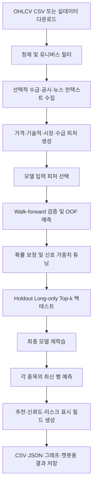

# Stock Predict 프로젝트 동작 원리

> 작성 기준: 2026-06-05 현재 소스 코드  
> 목적: 프로젝트를 처음 접한 사람이 입력부터 예측 결과 생성까지의 흐름을 빠르게 이해하도록 설명한다.

## 1. 한 문장 요약

이 프로젝트는 여러 종목의 과거 가격·거래량·시장·수급 데이터를 이용해 **다음 거래일 수익률과 상승 확률을 예측**하고, 시간 순서를 지키는 검증과 백테스트를 거쳐 결과를 `result/` 아래에 저장하는 연구용 파이프라인이다.

가장 중요한 정책은 다음과 같다.

- 사용자에게 표시하는 **매수/매도/관망 결정은 `predicted_return`만 사용**한다.
- 뉴스·공시·뉴스 영향 점수는 설명과 검토를 위한 표시 정보다.
- 뉴스·공시는 예상 수익률, 종목 순위, 추천 결정을 바꾸면 안 된다.
- 결과는 투자 참고 자료이며 자동매매 또는 투자 자문 결과가 아니다.

---

## 2. 전체 흐름



메인 오케스트레이터는 `src/pipeline.py`의 `run_pipeline()`이다. 내부적으로 다음 13단계를 순서대로 실행한다.

1. 설정 로딩
2. 입력 데이터 로딩
3. 데이터 정제 및 유니버스 필터
4. 투자자 수급·공시·뉴스 컨텍스트 추가
5. 가격 피처 생성
6. 외부 시장 피처 추가
7. Walk-forward 검증
8. 단순 기준 모델 평가
9. OOF 예측 구성
10. 신호 점수 가중치 튜닝
11. Holdout 백테스트와 그래프 생성
12. 최종 모델 학습 및 최신 예측
13. 결과 파일 저장

---

## 3. 입력 데이터

### 필수 열

| 열 | 의미 |
|---|---|
| `Date` | 거래일 |
| `Open` | 시가 |
| `High` | 고가 |
| `Low` | 저가 |
| `Close` | 종가 |
| `Volume` | 거래량 |

`Symbol`이 없으면 단일 종목 데이터로 처리할 수 있지만, 일반적인 실행에서는 종목 코드가 필요하다.

### 선택 입력

- 종목 유니버스 CSV
- yfinance 기반 실시간/최신 OHLCV
- 투자자 수급 외부 수집 비활성화
- DART 공시
- Naver 뉴스
- 외부 시장 지표
- 별도 `stock-news-impact` 실행 결과

### 기본 종목 유니버스

기본 종목 유니버스는 `data/kospi200_symbol_name_map.csv`에 저장된 **KOSPI200 200종목**이다.

- `--fetch-real` 또는 `--auto-refresh-real` 실행 시 `--real-symbols`와 `--universe-csv`를 모두 생략하면 KOSPI200 전체 200종목을 수집한다.
- `--real-symbols`를 지정하면 해당 종목 목록을 우선 사용한다.
- `--universe-csv`를 지정하면 해당 CSV의 `Symbol` 열을 우선 사용한다.
- 일반 파이프라인 실행은 `--universe-csv`를 생략하면 입력 OHLCV CSV에 존재하는 종목 전체를 처리한다.
- KOSDAQ 지수는 외부 시장 피처로 사용할 수 있지만, KOSDAQ 종목은 기본 종목 유니버스에 포함되지 않는다.

실데이터 갱신 기능은 `src/data/fetch_real_data.py`, 입력 정제는 `src/data/cleaners.py`, 유니버스 필터는 `src/data/universe.py`가 담당한다.

---

## 4. 피처 생성 원리

### 4.1 가격·기술적 피처

`src/features/price_features.py`와 `src/features/technical_indicators.py`가 종목별 시간 순서에 따라 피처를 만든다.

주요 피처:

- 일간·갭·장중 수익률
- 1/2/3/5/10/20/60일 수익률
- 이동평균과 현재가 대비 이동평균 비율
- 5/20/60일 변동성
- 거래량 비율과 거래대금
- RSI, MACD, ATR, Stochastic, CCI, OBV
- 외국인·기관 순매수와 누적/표준화 수급
- 52주 신고가 근접 여부
- 거래대금 순위와 시장 주도주 관련 피처

### 4.2 외부 시장 피처

`src/features/external_features.py`는 기본적으로 다음 시장 데이터를 수집한다.

- KOSPI, KOSDAQ
- S&P 500, NASDAQ, NASDAQ 선물, SOX
- VIX
- USD/KRW
- 미국 10년물 금리

각 지표는 종가, 1일/5일 수익률, 변동성 형태로 변환된다. 수집 실패 시 전체 실행을 무조건 중단하지 않고 coverage 정보를 남긴다.

### 4.3 시장 국면과 투자 신호

- `src/features/regime_features.py`: 상승/횡보와 고변동성/저변동성 조합으로 시장 국면 표시
- `src/features/investment_signals.py`: 거래대금, 수급, RSI, 신고가, NASDAQ 방향 등 사람이 해석하기 쉬운 신호 생성

### 4.4 예측 타깃

핵심 타깃은 다음 거래일 로그수익률이다.

```text
target_log_return = log(next_close / close)
target_up = target_log_return > 0
target_close = close × exp(target_log_return)
```

동일한 방식으로 5일과 20일 타깃도 만든다.

### 4.5 뉴스·공시 보호 경계

피처 생성 과정에는 뉴스·공시 관련 열이 존재할 수 있지만, `src/features/feature_selection.py`가 다음 표시 전용 열을 모델 입력에서 제외한다.

- `disclosure_score`
- `news_sentiment`
- `news_relevance_score`
- `news_impact_score`
- `news_article_count`
- 뉴스 기반 파생 신호
- 뉴스·공시를 포함한 복합 이벤트 점수

즉, 뉴스·공시는 결과 화면의 설명에는 나타날 수 있지만 모델 예측값에는 들어가지 않는다.

---

## 5. 모델 구조

`src/models/lgbm_heads.py`의 `MultiHeadStockModel`은 하나의 값만 예측하지 않고 여러 예측 헤드를 함께 관리한다.

| 헤드 | 출력 |
|---|---|
| 회귀 | 다음날 로그수익률 |
| 분류 | 다음날 상승 확률 |
| 분위수 회귀 | 낮은/중앙/높은 예상 수익률 구간 |
| 다중 기간 회귀·분류 | 5일·20일 로그수익률과 상승 확률 |

LightGBM을 사용할 수 있으면 LightGBM을 사용하고, 사용할 수 없는 환경에서는 sklearn Gradient Boosting 계열 모델로 대체한다.

분위수 상단과 하단의 차이는 예측 불확실성을 표현한다.

```text
uncertainty_width = quantile_high - quantile_low
```

---

## 6. 시간 누수를 막는 검증

일반 랜덤 분할은 미래 데이터가 과거 학습에 섞일 수 있으므로 사용하지 않는다. `src/validation/walk_forward.py`는 시간 순서대로 학습 구간과 검증 구간을 이동한다.

```text
과거 학습 ── purge gap ── 검증 구간
                         다음 fold로 이동 →
```

기본 설정:

- 최소 학습 구간: 756 거래일
- 검증 구간: 252 거래일
- 이동 간격: 126 거래일
- purge gap: 20일
- embargo: 0일

데이터가 부족하면 파이프라인이 학습·검증 구간을 줄여 재시도한다.

각 검증 구간에서 생성된 예측을 OOF(Out-of-Fold) 예측이라고 한다. OOF 예측은 해당 행을 학습에 직접 사용하지 않은 모델의 예측이므로, 성능 측정과 백테스트에 더 적합하다.

평가 항목:

- 회귀: MAE, RMSE, 상관계수
- 분류: Accuracy, ROC-AUC
- 기준 모델: 0% 수익률 예측, 직전 수익률 기반 예측
- 확률 보정 상태와 OOF 진단

---

## 7. 예측값과 점수 계산

### 7.1 사용자에게 보이는 예상 수익률

모델은 로그수익률을 출력하고, 파이프라인은 이를 퍼센트 수익률과 예상 종가로 변환한다.

```text
predicted_return = (exp(predicted_log_return) - 1) × 100
predicted_close = Close × exp(predicted_log_return)
```

### 7.2 진단·순위용 `signal_score`

`signal_score`는 예측값을 비교하고 백테스트 후보를 고르는 복합 점수다.

```text
signal_score =
    return_weight × norm_return
  + up_prob_weight × up_probability
  + rel_strength_weight × rel_strength
  - uncertainty_penalty × uncertainty_score
```

기본 가중치:

- 수익률 순위: `0.45`
- 상승 확률: `0.35`
- 상대 강도: `0.20`
- 불확실성 패널티: `0.25`

OOF 데이터의 앞부분으로 가중치를 튜닝하고, 뒷부분을 백테스트 평가에 사용한다.

`signal_score`와 이벤트 점수는 진단과 설명을 위한 값이며, 최종 매수/매도/관망 결정을 바꾸지 않는다.

### 7.3 최종 추천 정책

`src/domain/signal_policy.py`의 추천 기준:

```text
predicted_return >  2.0%  → 매수
predicted_return <= -2.0% → 매도
그 외                  → 관망
```

신뢰도, 상승 확률, 수급, 뉴스, 공시, 시장 상황은 추천 옆에 참고 정보와 리스크 경고로 표시될 뿐이다.

---

## 8. 백테스트 원리

`src/validation/backtest.py`는 OOF holdout 구간에서 long-only top-k 전략을 평가한다.

기본 후보 조건:

- 상승 확률 `>= 0.50`
- 신호 점수 `>= 0`
- 최소 거래대금 `>= 30억 원`
- 후보 중 상위 `20`개

추가로 다음 현실 조건을 반영한다.

- 포트폴리오 규모와 일일 거래 참여 한도
- 시장 유형별 최대 보유 종목 수
- 회전율 제한
- 거래 수수료와 기본/동적 슬리피지
- 외부 시장·투자자 데이터 coverage gate

백테스트의 종목 순위는 다음날 예상 수익률을 중심으로 처리되며, 뉴스 관련 열이 순위를 바꾸지 못하도록 테스트로 보호한다.

주요 결과:

- 누적 수익률
- 일평균 수익률
- Sharpe
- 최대 낙폭
- 평균 회전율
- 벤치마크 대비 초과 수익률
- 거래 중단/유동성 차단 일수

---

## 9. 최종 예측 생성

검증과 튜닝이 끝나면 파이프라인은 다음 순서로 최신 예측을 만든다.

1. 타깃이 존재하는 과거 행으로 최종 모델 학습
2. 기본적으로 최근 756 거래일 범위 사용
3. 종목별 가장 최신 행 선택
4. 다음날·5일·20일 예측 생성
5. 상승 확률 보정
6. OOF 기반 종목별 과거 방향 적중률 결합
7. 추천, 신뢰도, 리스크 플래그, 포지션 힌트 생성
8. 뉴스·공시·뉴스 영향 문맥을 표시용으로 추가

뉴스·공시 문맥은 이 마지막 표시 단계에서 붙으며 이미 생성된 예측과 추천을 변경하지 않는다.

---

## 10. 결과 파일

모든 생성 파일은 `result/` 아래에 저장된다.

| 파일 | 용도 |
|---|---|
| `result_detail.csv` | 최신 예측과 상세 피처·진단 정보 |
| `result_simple.csv` | 사용자·Kakao 챗봇용 간단 요약 |
| `result_news.csv` | 뉴스 표시 정보 |
| `result_disclosure.csv` | 공시 표시 정보 |
| `pm_report.json` | 포트폴리오 매니저 스타일 요약 |
| `pipeline_report.json` | 설정, 검증, 백테스트, coverage, 산출물 경로 |
| `figures/` | 백테스트·예측 비교·진단 그래프 |

CSV는 Windows Excel 호환을 위해 `utf-8-sig`로 저장한다.

---

## 11. 모듈별 책임

| 경로 | 책임 |
|---|---|
| `src/pipeline.py` | 전체 실행 순서와 CLI |
| `src/config/` | dataclass 기본 설정과 JSON override |
| `src/data/` | 입력, 정제, 실데이터, 유니버스, 수급·공시·뉴스 수집 |
| `src/features/` | 모델용 피처와 표시용 신호 생성, 모델 피처 선택 |
| `src/models/` | 다중 헤드 모델 학습·예측·저장 |
| `src/validation/` | Walk-forward, OOF, 보정, 튜닝, 백테스트 |
| `src/inference/` | 예측 프레임과 신호 점수 생성 |
| `src/domain/` | 추천·신뢰도·리스크 정책 |
| `src/reports/` | CSV, JSON, 그래프, 이슈 요약 |
| `src/news_impact/` | 별도 뉴스 영향 수집·점수화 파이프라인 |
| `src/chatbot/` | Kakao 웹훅, 캐시, 백그라운드 예측 실행 |
| `src/recommendation/` | 별도 추천 보조 기능 |

---

## 12. 뉴스 영향 모듈과 메인 예측의 관계

`src/news_impact/`는 뉴스·공시를 수집하고 중복 제거, 이벤트 분류, 영향 점수화, 보고서 생성을 수행하는 별도 모듈이다.

메인 주가 예측과의 관계:

```text
뉴스 영향 모듈 결과
        ↓
result_detail/result_simple/Kakao 표시 문맥에 병합
        ✕
predicted_return·순위·추천 결정에는 사용하지 않음
```

한국 종목 관련 뉴스는 한국어 검색어와 한국 매체를 우선하며, 해외 매체는 명시적으로 필요할 때 사용한다.

---

## 13. Kakao/Colab 동작

`src/chatbot/kakao_colab_bot.py`는 다음 역할을 한다.

- Flask 기반 Kakao 웹훅 제공
- 종목명/종목 코드 요청 해석
- `result_simple.csv` 중심의 캐시 응답
- 오래된 캐시 감지
- 필요 시 백그라운드 파이프라인 실행
- Colab 환경에서 pyngrok 터널 시작
- 사전 예열과 실행 설정 signature 관리

챗봇은 모델 자체가 아니라 파이프라인 결과를 사용자에게 전달하는 인터페이스다.

---

## 14. 실행 예시

### 샘플 데이터로 안전하게 실행

```powershell
python src/pipeline.py `
  --input data/sample_ohlcv.csv `
  --disable-external `
  --report-json pipeline_report_smoke.json `
  --figure-dir figures_smoke
```

### 설치된 CLI 사용

```powershell
stock-predict --input data/sample_ohlcv.csv --disable-external
```

### 기본 KOSPI200 전체 실데이터 갱신 후 실행

`--real-symbols`와 `--universe-csv`를 생략하면 기본 KOSPI200 200종목 전체를 수집한다.

```powershell
python src/pipeline.py `
  --fetch-real `
  --input data/real_ohlcv.csv
```

최신 데이터를 증분 갱신하려면 다음을 실행한다.

```powershell
python src/pipeline.py `
  --auto-refresh-real `
  --input data/real_ohlcv.csv
```

### 지정 종목만 실데이터 갱신 후 실행

```powershell
python src/pipeline.py `
  --fetch-real `
  --input data/real_ohlcv.csv `
  --real-symbols 005930.KS 000660.KS
```

### 테스트

```powershell
pytest
pytest tests/test_pipeline_smoke.py
```

---

## 15. 코드를 읽을 때 주의할 점

1. **예측값과 추천은 다르다.**  
   모델은 로그수익률과 상승 확률을 예측하지만 추천 라벨은 `predicted_return` 임계값 정책이 결정한다.

2. **`signal_score`는 추천값이 아니다.**  
   후보 비교, 진단, 백테스트 보조 점수다.

3. **OOF와 최신 예측은 목적이 다르다.**  
   OOF는 검증·튜닝·백테스트용이고, 최신 예측은 전체 학습 후 실제 최신 행에 적용한 값이다.

4. **뉴스·공시는 표시 전용이다.**  
   관련 열이 데이터프레임에 존재해도 모델 피처 선택 단계에서 제외된다.

5. **외부 데이터 실패는 coverage로 관리한다.**  
   일부 외부 연동 실패가 항상 실행 실패를 뜻하지는 않지만, coverage가 낮으면 백테스트 중단이나 리스크 경고가 발생할 수 있다.

6. **모든 산출물은 `result/` 아래로 정규화된다.**  
   입력 데이터나 소스 디렉터리에 결과 파일을 직접 쓰지 않는다.

---

## 16. 핵심 소스 읽기 순서

프로젝트를 더 깊게 이해하려면 아래 순서가 가장 빠르다.

1. `src/pipeline.py`
2. `src/config/settings.py`
3. `src/features/price_features.py`
4. `src/features/feature_selection.py`
5. `src/models/lgbm_heads.py`
6. `src/validation/walk_forward.py`
7. `src/validation/backtest.py`
8. `src/inference/predict.py`
9. `src/pipeline_support.py`
10. `src/domain/signal_policy.py`
11. `src/reports/output.py`
12. `src/chatbot/kakao_colab_bot.py`
