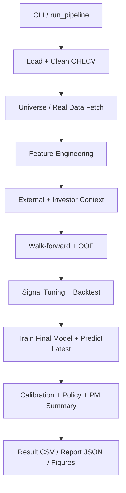

# Stock Predict 결과보고서

## 1) 보고서 목적
본 문서는 현재 `stock_predict` 프로젝트의 **실행 아키텍처와 데이터/모델 흐름**, **핵심 함수의 역할**, 그리고 실제 운영 중 고려된 **문제 해결(안정성/품질/운영성) 과정**을 정리한 결과보고서입니다.

---

## 2) 시스템 전체 동작 흐름

파이프라인의 진입점은 `src/pipeline.py`의 `run_pipeline()`이며, 개략적인 동작 순서는 다음과 같습니다.

1. 실행 설정(AppConfig) 로드 및 CLI override 반영
2. 입력 OHLCV 로드 후 정제(cleaning)
3. 유니버스 필터/실데이터 수집(옵션) 반영
4. 가격/기술 지표 feature 생성
5. 외부 시장지표 feature 결합(옵션)
6. 투자자 컨텍스트 결합(옵션)
7. 시장 국면 annotation
8. Walk-forward OOF 검증
9. 베이스라인 성능 계산
10. 신호 점수 튜닝 및 백테스트
11. 최종 모델 재학습 + 최신 시점 추론
12. 확률 calibration, 정책 프레임 생성, PM 요약 생성
13. CSV/JSON/그래프 산출물 저장

### 흐름도(요약)

---

## 3) 모듈별 핵심 함수와 역할

> 함수 수가 많은 프로젝트이므로, 실제 실행 흐름에 직접 기여하는 **핵심 함수 중심**으로 정리했습니다.

## 3-1. Orchestration 레이어

### `src/pipeline.py`
- `run_pipeline(...)`
  - 전체 E2E 오케스트레이션 담당
  - 설정 로드, 데이터 전처리, 피처 생성, 검증/튜닝/백테스트, 최종 추론, 산출물 저장까지 실행
- `build_cli_parser()` / `main()`
  - CLI 옵션을 파싱하고 파이프라인 실행
- `resolve_output_path()`, `resolve_output_dir()`
  - 산출물을 프로젝트 `result/` 아래로 정규화해 저장 경로 일관성 보장
- `_calibrate_up_probability()`
  - OOF 기반 isotonic calibration 수행
  - calibration 후 확률 분산이 과도하게 붕괴될 경우(raw 대비 unique 감소) 원확률과 혼합해 랭킹 보존
- `_coverage_gate_status()`
  - 외부/투자자 컨텍스트 커버리지를 기준으로 `normal/caution/halt` 상태 결정
- `_split_oof_for_tuning_and_eval()`
  - 시계열 기준 OOF를 튜닝/평가 구간으로 분리
- `_drop_empty_detail_columns()`
  - 실행 시 비어 있는 optional 컬럼 정리로 결과 CSV 가독성 개선

### `src/pipeline_support.py`
- `build_scored_prediction_frame(...)`
  - 기본 예측 프레임에 optional 컬럼/커버리지/시장역풍 점수/이벤트 부스트를 결합
- `build_symbol_history_accuracy(...)`
  - 종목별 방향 정확도 이력 집계
- `finalize_latest_prediction_frame(...)`
  - 심볼명 매핑, 신뢰도/라벨 계산, 정책 기반 추천/리스크 필드 확정

---

## 3-2. Data 레이어

### `src/data/loaders.py`
- `load_ohlcv_csv(...)`
  - 입력 CSV 로딩, 필수 컬럼 검증, 날짜/심볼 정렬 표준화

### `src/data/cleaners.py`
- `clean_ohlcv(...)`
  - 수치형 강제 변환, 이상값/중복 제거, 봉(OHLC) 무결성 보정

### `src/data/fetch_real_data.py`
- `normalize_user_symbols(...)`
  - 사용자 입력 심볼을 yfinance/국내 심볼 체계에 맞게 정규화
- `fetch_real_ohlcv(...)`
  - 다종목 시세 수집 후 통합 스키마로 반환
- `save_real_ohlcv_csv(...)`, `append_real_ohlcv_csv(...)`
  - 전체 저장 또는 기존 CSV에 종목 추가 병합

---

## 3-3. Feature Engineering 레이어

### `src/features/price_features.py`
- `build_features(...)`
  - 수익률/변동성/모멘텀/거래량 계열 피처 생성
  - RSI/MACD/ATR/Stochastic/CCI/OBV 생성
  - 학습 타깃(1d, 5d, 20d 수익률 및 상승 여부) 동시 생성

### `src/features/external_features.py`
- `add_external_market_features_with_coverage(...)`
  - 대외 지표를 결합하고 coverage 통계를 리포팅
  - 다운로드 실패 시 fallback/skip을 포함한 방어적 처리

### `src/features/regime_features.py`
- `annotate_market_regime(...)`
  - 이동평균/변동성 기반 시장 국면 라벨링

### `src/features/investment_signals.py`
- `add_investment_signal_features(...)`
  - 투자자 수급/모멘텀/이벤트 계열 신호 피처 구성

---

## 3-4. Model / Validation 레이어

### `src/models/lgbm_heads.py`
- `MultiHeadStockModel`
  - 회귀(수익률), 분류(상승확률), 분위수(불확실성) 멀티헤드 예측
  - 환경에 따라 LightGBM 또는 fallback estimator 사용
- `MultiHeadPrediction`
  - 멀티헤드 추론 결과를 담는 전용 데이터 구조

### `src/validation/walk_forward.py`
- `walk_forward_validate_with_oof(...)`
  - 시계열 fold 검증 + OOF 생성
- `_iter_folds(...)`
  - 최소 학습길이/테스트길이/스텝 기준으로 fold 분할

### `src/validation/signal_tuning.py`
- `tune_signal_weights(...)`
  - 신호 가중치 탐색을 통해 백테스트 효율 향상

### `src/validation/backtest.py`
- `run_long_only_topk_backtest(...)`
  - Long-only Top-K 백테스트 수행
  - 유동성/참여율/시장유형 편중/회전율 cap 반영

### `src/validation/metrics.py`
- `probability_calibration_metrics(...)`
  - Brier/ECE 등 확률 calibration 품질 지표 산출

---

## 3-5. Domain / Reporting 레이어

### `src/domain/signal_policy.py`
- `recommendation_from_signal(...)`
  - 점수/수익률/확률/불확실성 기반 액션 추천
- `vectorized_event_signal_boost(...)`
  - 이벤트성 신호를 벡터화 방식으로 가중 보정
- `build_prediction_policy_frame(...)`
  - 추천/리스크/포지션 힌트/사유 등 의사결정 컬럼 생성

### `src/reports/result_formatter.py`
- `build_result_simple(...)`
  - 사용자 전달용 최소 핵심 컬럼 리포트 생성
- `print_prediction_console_summary(...)`
  - 콘솔 Top 요약 출력

### `src/reports/pm_report.py`
- `build_pm_report(...)`
  - 포트폴리오 관점의 실행 요약(JSON) 생성
- `save_pm_report(...)`
  - PM 리포트 파일 저장

### `src/reports/visualize.py`
- 성능곡선/진단그래프/심볼레벨 그래프 산출

---

## 4) 문제 해결 과정 (핵심 이슈 & 대응)

## 4-1. 입력/출력 운영 안정성
- **문제**: OS/실행환경에 따라 결과물 저장 경로가 제각각이거나 권한 문제가 발생할 수 있음
- **해결**:
  - 출력 경로를 `result/` 하위로 강제 정규화 (`resolve_output_path`, `resolve_output_dir`)
  - 파일이 열려 있어 저장 실패(PermissionError) 시 fallback 파일명으로 자동 저장 (`_safe_to_csv`)
- **효과**: 운영 환경별 경로 혼선을 줄이고 저장 실패로 인한 파이프라인 중단 가능성을 낮춤

## 4-2. 외부 데이터 연동 실패 내성
- **문제**: 외부 지표/실데이터 수집은 네트워크/티커 이슈로 실패 가능성이 높음
- **해결**:
  - 외부 피처 모듈에서 심볼 후보군/다운로드 실패 처리/fallback 전략 적용
  - 성공·실패·fallback 수를 coverage로 집계해 리포트에 포함
- **효과**: 일부 소스 장애가 있어도 전체 파이프라인은 진행 가능하고, 품질 저하를 수치로 추적 가능

## 4-3. 확률 calibration의 과평탄화(plateau) 방지
- **문제**: isotonic regression은 샘플 조건에 따라 확률을 과도하게 평탄화하여 종목 간 순위 분별력을 떨어뜨릴 수 있음
- **해결**:
  - calibration 결과 unique 값이 급격히 줄어드는 경우 raw 확률과 혼합(0.3/0.7)해 분별력 유지
- **효과**: calibration의 안정성과 랭킹 유효성을 동시에 확보

## 4-4. 컨텍스트 품질 기반 게이팅
- **문제**: 외부/투자자 컨텍스트 결손이 큰 상태에서 거래 신호를 그대로 사용하면 의사결정 품질이 흔들릴 수 있음
- **해결**:
  - 커버리지 기반 `normal/caution/halt` 게이트 상태를 계산해 백테스트/실행단에서 반영
- **효과**: 데이터 신뢰도 하락 구간에서 과도한 액션을 억제

## 4-5. 서비스 출력 품질(사용자 전달물)
- **문제**: 상세 결과 CSV는 컬럼이 많고 비어 있는 선택 컬럼이 섞여 가독성이 낮을 수 있음
- **해결**:
  - 비어 있는 optional 컬럼 자동 제거
  - 사용자용 간소화 리포트(`result_simple`) 별도 생성
- **효과**: 분석용 상세 결과와 사용자 전달물의 목적 분리

---

## 5) 테스트 및 검증 체계 요약
- `tests/` 폴더에서 파이프라인 스모크, 외부지표 fallback, signal policy, investor context 통합, 챗봇 연동, 시각화, 확률 calibration 가드 등을 분리 검증합니다.
- 특히 스모크 테스트는 E2E 실행 여부와 산출물 형식 무결성을 빠르게 확인하는 용도로 활용됩니다.

---

## 6) 결론
현재 프로젝트는 단순 예측 모델을 넘어, 다음을 포함하는 **운영형 예측 파이프라인**으로 구성되어 있습니다.

- 멀티헤드 예측 + 불확실성 + 다중 호라이즌
- 데이터 품질/커버리지 기반 게이팅
- 백테스트/정책 프레임/PM 요약까지 포함한 의사결정 지원
- 외부 연동 실패에 대한 복원력 및 결과물 표준화

즉, 모델 성능뿐 아니라 **실행 안정성·설명 가능성·운영 적합성**을 함께 고려한 구조라는 점이 본 프로젝트의 핵심 성과입니다.
